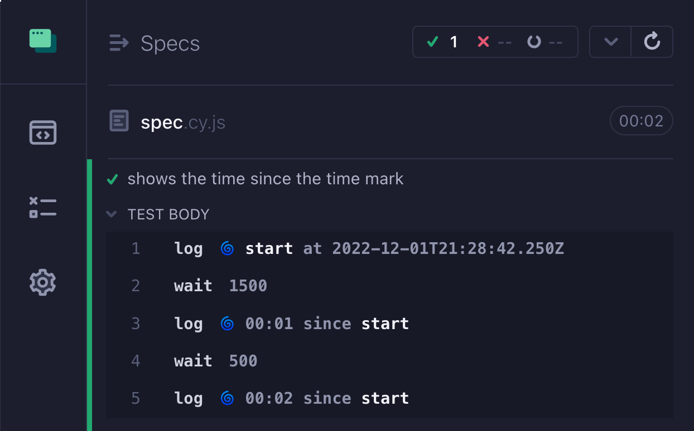
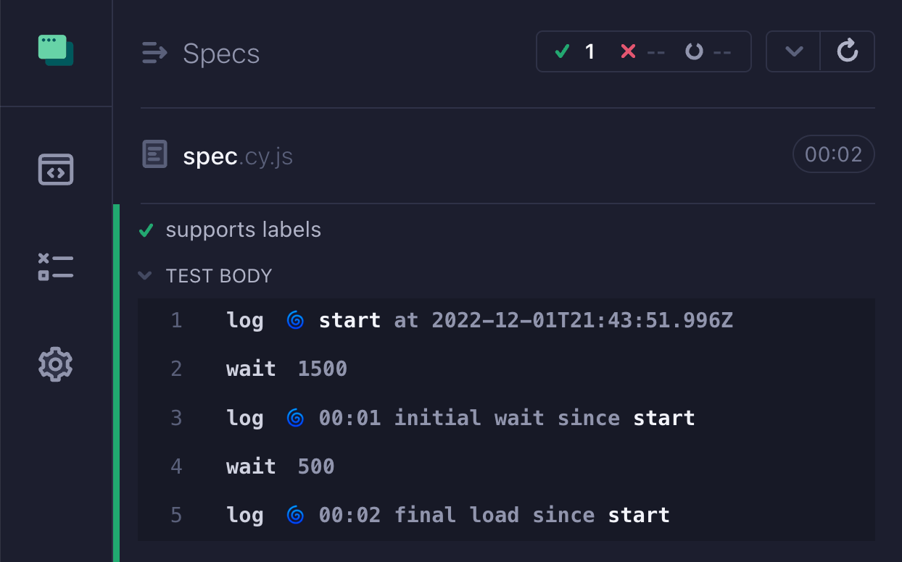
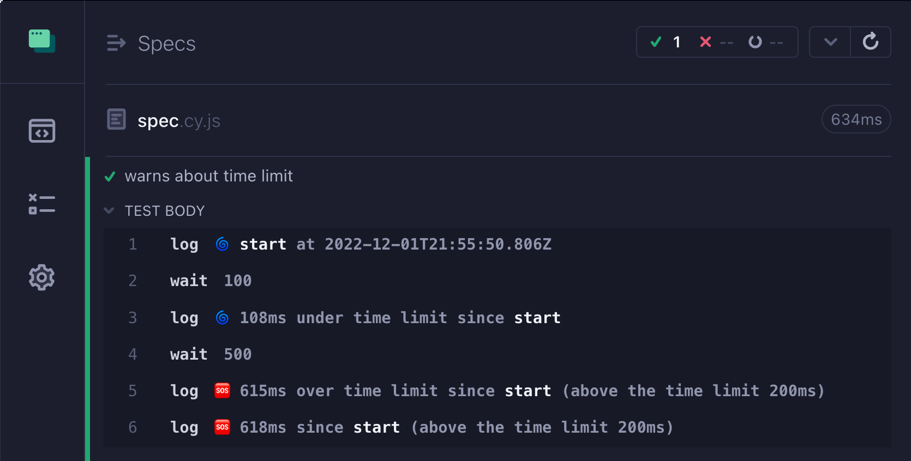
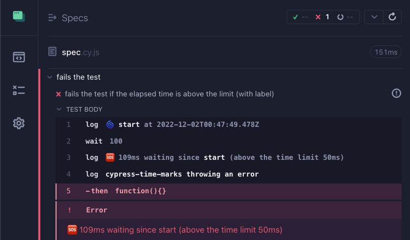

# cypress-time-marks 

> Custom Cypress commands to measure elapsed time

```js
cy.timeMark('start').wait(1500).timeSince('start').wait(500).timeSince('start')
```



See [spec.cy.js](./cypress/e2e/spec.cy.js)

## Install

Add this plugin as a dev dependency

```
# if using NPM
$ npm i -D cypress-time-marks
# if using Yarn
$ yarn add -D cypress-time-marks
```

Import this plugin from the spec file or from the support file

```js
// cypress/e2e/spec.cy.js or cypress/support/e2e.js
import 'cypress-time-marks'
```

This should give you two new custom commands `cy.timeMark(name)` and `cy.timeSince(name)`. If you want TypeScript definitions, this module [includes them](./src/index.d.ts):

```js
// my spec JS file
/// <reference types="cypress-time-marks" />
```

## Options

```ts
cy.timeSince(markName: string, label?: string, timeLimit?: number, throwError?: boolean)
```

### labels

You can log a label when using `cy.timeSince(name, label)`

```js
cy.timeMark('start')
  .wait(1500)
  .timeSince('start', 'initial wait')
  .wait(500)
  .timeSince('start', 'final load')
```



### time limit warning

You can pass a time limit after the mark name to warn if the elapsed time is longer than the limit. It won't fail the test, but it will change the icon to warn you.

```js
cy.timeMark('start')
  .wait(100)
  .timeSince('start', 'under time limit', 200)
  .wait(500)
  .timeSince('start', 'over time limit', 200)
  .timeSince('start', 200)
```



### fail the test

You can fail the test if the elapsed time is above the given limit.

```js
cy.timeMark('start').wait(100).timeSince(
  'start', // mark name
  'waiting', // message
  50, // time limit (ms)
  true, // throw an error if above the time limit
)
```



## See also

- [cypress-timestamps](https://github.com/bahmutov/cypress-timestamps) plugin

## Small print

Author: Gleb Bahmutov &lt;gleb.bahmutov@gmail.com&gt; &copy; 2022

- [@bahmutov](https://twitter.com/bahmutov)
- [glebbahmutov.com](https://glebbahmutov.com)
- [blog](https://glebbahmutov.com/blog)
- [videos](https://www.youtube.com/glebbahmutov)
- [presentations](https://slides.com/bahmutov)
- [cypress.tips](https://cypress.tips)
- [Cypress Tips & Tricks Newsletter](https://cypresstips.substack.com/)
- [my Cypress courses](https://cypress.tips/courses)

License: MIT - do anything with the code, but don't blame me if it does not work.

Support: if you find any problems with this module, email / tweet /
[open issue](https://github.com/bahmutov/cypress-time-marks/issues) on Github
